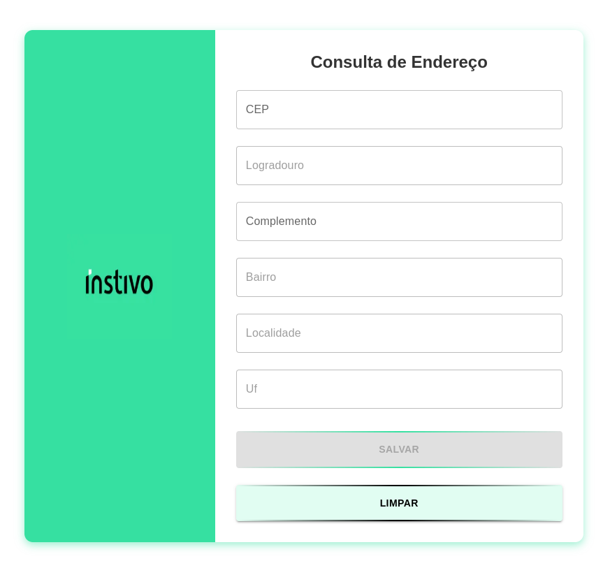
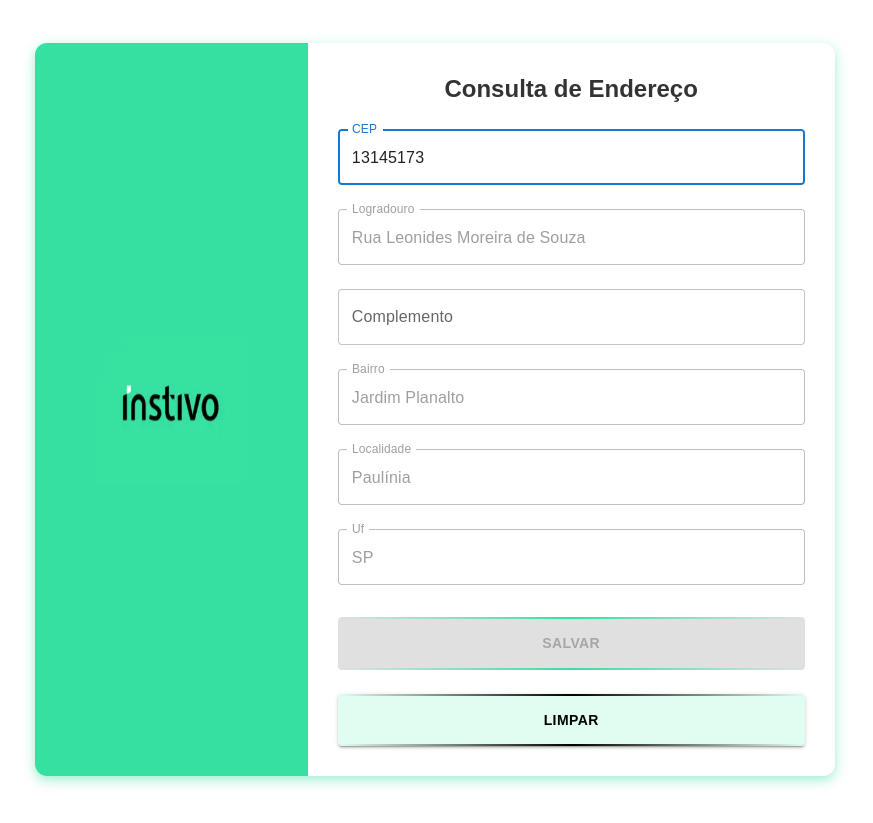
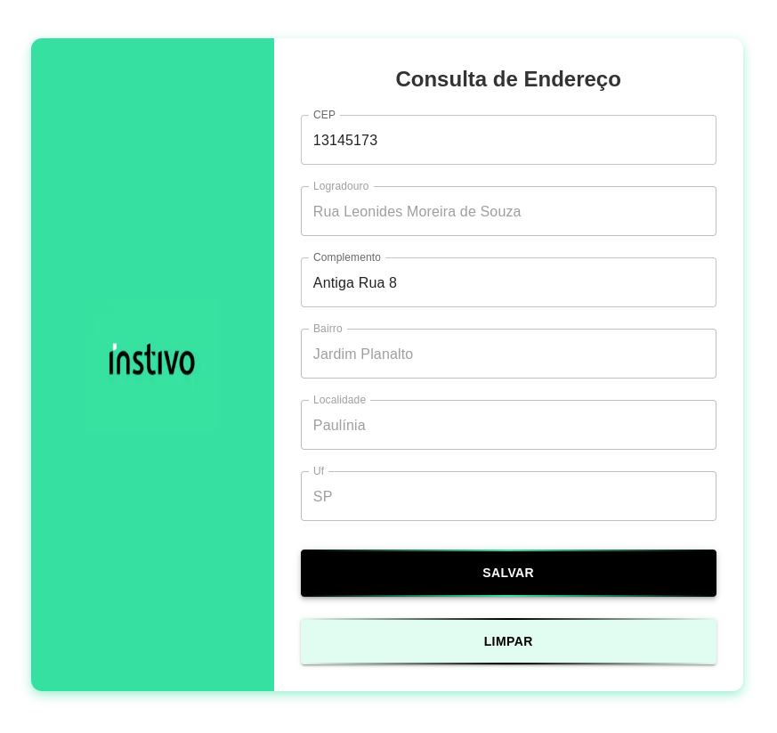
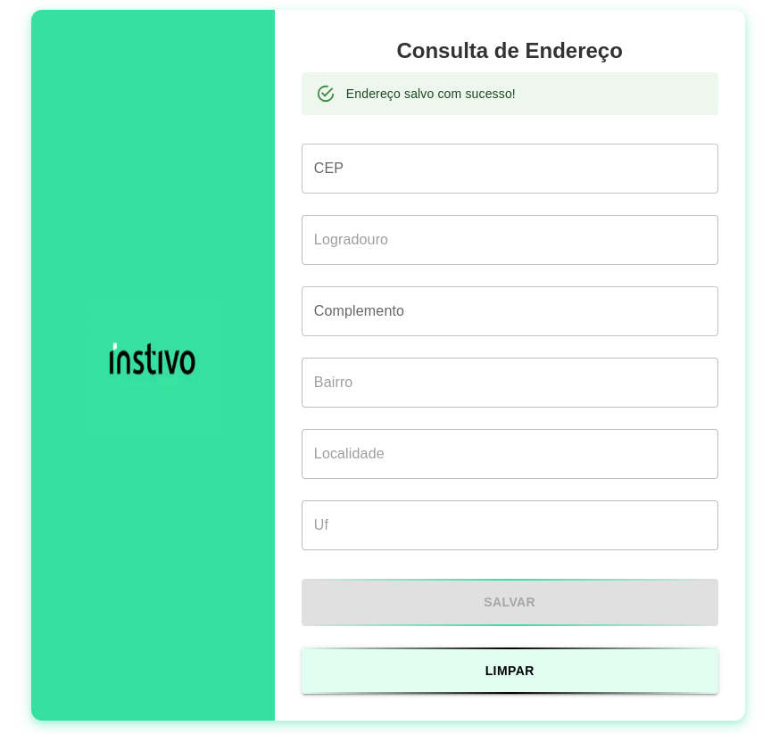
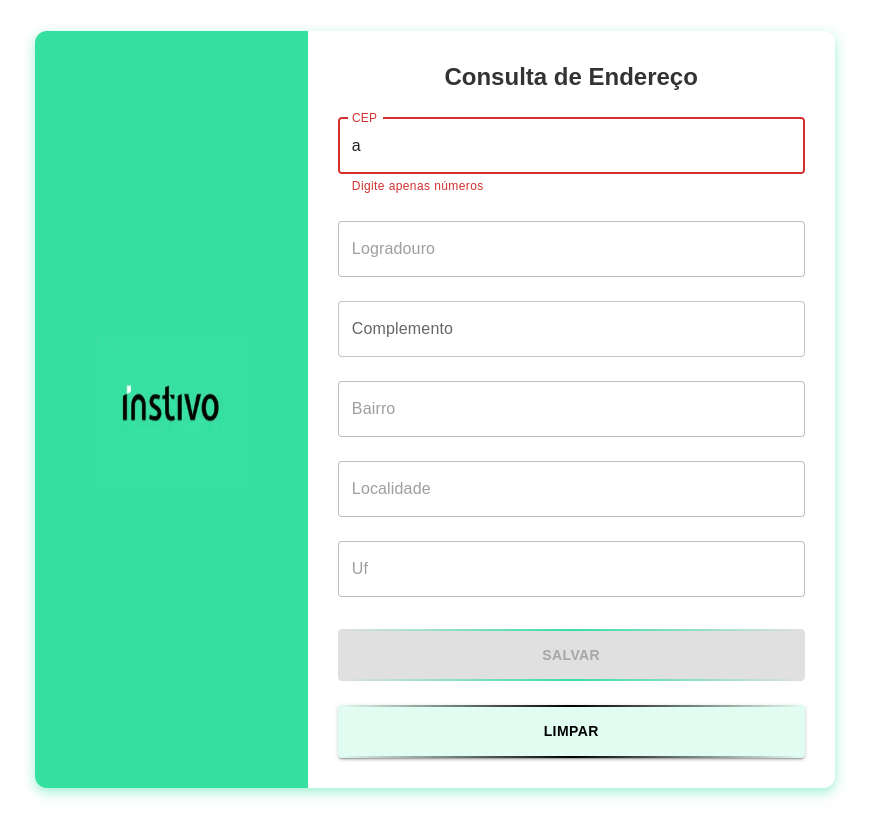

# 📦 Projeto - Teste Front-end - Consulta CEP

Um aplicativo web para consulta e salvamento de endereços com base no CEP! 🔍🏠

## 🚀 Tecnologias Utilizadas

Este projeto foi desenvolvido com as seguintes tecnologias:

- ⚛️ **[React](https://react.dev/)** - Biblioteca JavaScript para criar interfaces
- 🌍 **[Next.js](https://nextjs.org/)** - Framework React para SSR e SSG
- 💅 **[Material UI](https://mui.com/)** - Componentes estilizados prontos para React
- 🔄 **[React Hook Form](https://react-hook-form.com/)** - Gerenciamento de formulários
- 📦 **[React Query](https://tanstack.com/query/latest)** - Gerenciamento de requisições assíncronas

## ✨ Funcionalidades

✅ Consulta endereços a partir do CEP digitado
✅ Preenchimento automático dos campos do formulário
✅ Validação de CEP (somente números e limite de 8 dígitos)
✅ Armazena endereços em um arquivo JSON local
✅ Interface moderna e responsiva

## 🛠️ Como Rodar o Projeto

### 1️⃣ Clone o repositório

```bash
git clone https://github.com/gi-lais/consulta-cep.git
```

### 2️⃣ Acesse a pasta do projeto

```bash
cd consulta-cep
```

### 3️⃣ Instale as dependências

```bash
npm install  # ou yarn install # ou pnpm install
```

### 4️⃣ Execute o projeto

```bash
npm run dev  # ou yarn dev # ou pnpm dev
```

O projeto estará rodando em **http://localhost:3000** 🚀

## 📷 Capturas de Tela

>  >  >  >  > 

Feito com ❤️ por [Giovanna Laís](https://github.com/gi-lais) 🚀
